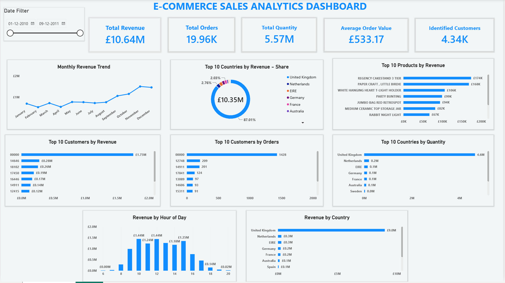

# E-Commerce Sales Analytics

**Python | SQL | MySQL | Power BI | DAX**

## Dashboard Preview

## Project Overview

This project analyzes e-commerce sales data to understand revenue, orders, products, customers, countries, and purchasing time patterns.

The project follows an end-to-end analytics workflow using **Python, MySQL, and Power BI**, starting with data cleaning and exploratory analysis and ending with an interactive dashboard.

## Tools Used

- Python
- Pandas
- MySQL / SQL
- Power BI
- DAX
- Jupyter Notebook

## Key Performance Indicators

| KPI | Value |
|---|---:|
| Total Revenue | £10.64M |
| Total Orders | 19.96K |
| Total Quantity | 5.57M |
| Average Order Value | £533.17 |
| Identified Customers | 4.34K |

## Key Business Insights

- The business generated approximately **£10.64M in revenue** from **19,960 orders**.
- Approximately **5.57M units** were sold, with an average order value of **£533.17**.
- Revenue performance was analysed across **countries, products, and customers**.
- Monthly revenue trends and **revenue by hour of day** were analysed to understand purchasing patterns.
- The Power BI dashboard allows users to explore sales performance using an **interactive date filter**.

## Analysis Performed

- Python-based data cleaning and exploratory analysis
- SQL-based sales and customer analysis
- Product and country performance analysis
- Customer revenue and order analysis
- Monthly revenue trend analysis
- Hourly revenue analysis
- Interactive Power BI dashboard development

## Skills Demonstrated

- Python & Pandas
- SQL / MySQL
- Power BI
- DAX
- Data Cleaning
- Exploratory Data Analysis
- Data Visualization
- Dashboard Development
- Business Insight Generation

## Project Files

- [Python Analysis](e%20commerce%20sales%20analysis.ipynb)
- [SQL Analysis](e%20commerce%20sales%20analysis)
- [Power BI Dashboard](e%20commerce%20sales%20analytics%20dashboard.pbix)
- [Project Report](e%20commerce%20sales%20analytics%20project%20.doc)

## Data Limitation

The dataset contains transactions only through **9 December 2011**, so December represents a partial month.

## Conclusion

This project demonstrates an end-to-end data analytics workflow using **Python, SQL, and Power BI**, transforming raw e-commerce transactions into KPIs, visual analysis, and business insights.
